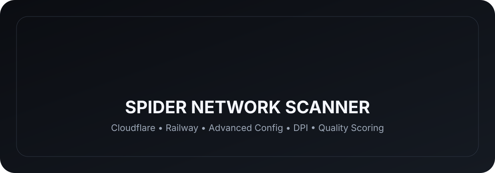
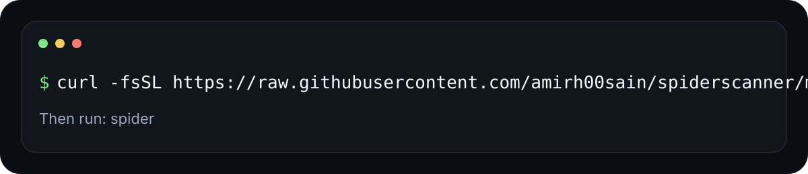

# 🕷️ Spider Network Scanner

<p align="center"></p>

A fast terminal UI for Railway, Cloudflare, Fastly, and Amazon CloudFront endpoint checks, Advanced config replacement, DPI config URI generation, and multi-metric endpoint quality scoring.

Version: **1**

### Quality scoring

Spider now ranks verified endpoints with a measured quality score based on packet loss (30%), latency/ping (20%), jitter (15%), real HTTPS throughput when measurable (15%), probe reliability (10%), and service/dataplane validation (10%). Metrics that are not measurable for a protocol are excluded and their weight is redistributed instead of being treated as zero. HTTPS endpoints can receive a real download-throughput measurement.

---

## 🚀 Installation

<p align="center"></p>

Or run the command directly:

```bash
curl -fsSL https://raw.githubusercontent.com/amirh00sain/spiderscanner/main/install.sh | bash
```

Then open Spider:

```bash
spider
```

The installer installs Spider under `~/.local/share/spider` and creates the `spider` command in `~/.local/bin`.

---

## ✦ Briefly

Spider provides a structured terminal UI with live, stoppable CDN scans for Railway, Cloudflare, Fastly, and Amazon CloudFront, Advanced Railway/Cloudflare/Fastly/Amazon CloudFront config replacement, DPI config URI generation, and a built-in Speed Test. Fastly ranges are sourced from its public IP list and Amazon CloudFront ranges from its published edge-IP list; the CDN menu can refresh those snapshots. Fastfetch with the `amirh00sain` dot-matrix logo is shown at the top of the main menu.

---

## 📢 Contact

**GitHub**  
https://github.com/amirh00sain/SpiderPanel

**Telegram**  
https://t.me/amirsp1ider

---

<p align="center"></p>

<p align="center">Made by <b>amirh00sain</b></p>


### Advanced config scanning

Advanced now supports Railway, Cloudflare, Fastly, and Amazon CloudFront. Each provider accepts a base config, scans its provider ranges for verified TCP 443 endpoints, replaces only the `server` value, ranks the verified configs, and saves the generated configs under `~/.spider/advanced-*`.

## Connect
The main menu now includes `Connect` with Aether and Xray. Aether uses the bundled upstream source and builds locally when needed. Xray accepts one or many configs at once (VLESS, VMess, Trojan, Shadowsocks, Hysteria2, WireGuard INI, SSH) and supports Proxy or native TUN mode. Proxy listens on port 1819; LAN sharing is controlled from Settings. The Live Status screen shows every profile with automatic 30-second ping/loss/jitter checks and a three-line Xray log box; ping providers are editable in Settings.

## Xray protocol monitoring
Xray can load multiple proxy profiles in one Connect session. Native Xray outbounds are used for VLESS, VMess, Trojan, Shadowsocks, Hysteria2 and WireGuard; SSH profiles use the system OpenSSH dynamic-SOCKS adapter and are then exposed to the same Xray routing layer. The bundled Xray version currently supports the native protocol set documented by Xray.

## Diag
`Diag` runs a full network health assessment covering TCP, UDP/DNS, HTTP, HTTPS, IPv4, IPv6, latency, packet loss, jitter, bandwidth and a set of important services (Cloudflare, Google, Let's Encrypt, Xbox, AMD, Python, Vercel, GitHub, Microsoft, Amazon, npm, PyPI, Docker, Debian, Arch Linux, Steam and Wikipedia). It renders tables and a weighted overall score.

### SNI Spoof
`Connect → SNI Spoof` provides Custom, Auto and Last Find. Custom takes an IP + fake SNI; Auto scans the ordered IPv4 candidates in `data/cf_subnets.txt` against the ordered names in `data/sni-list.txt`, testing candidate pairs through Xray and caching only the successful IP/SNI metadata. The Last Find option is hidden until such a result exists.
